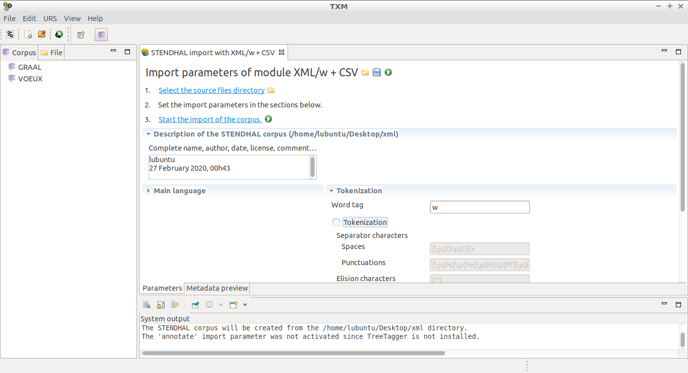
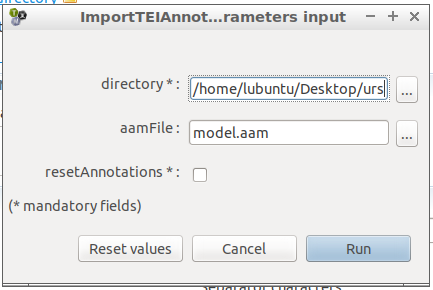
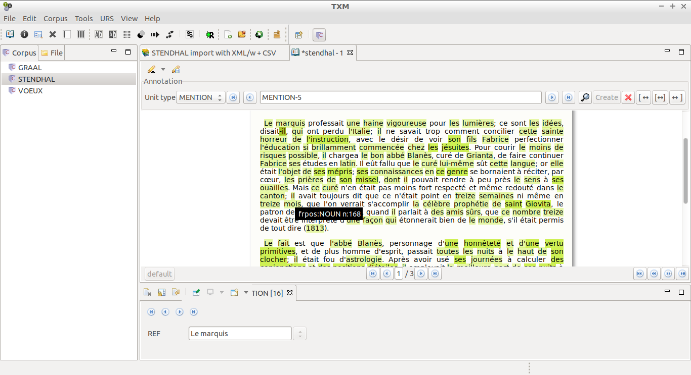

# Conversion from jsonlines to TEI-URS

This script converts a jsonlines file to a set of TEI-URS files, which can be imported into softwares such as TXM.

## Description of TEI-URS, jsonlines and TXM

### TEI-URS

The **TEI-URS** format is a XML-compliant TEI format used to store (in our case) coreferential annotations.  It contains both the text and stand-off annotations, which can be stored in two separate files.  The format is precisely described in the following paper:

> Loïc Grobol, Frédéric Landragin, and Serge Heiden. 2017.  Interoperable annotation of (co)references in the Democrat project.  Thirteenth Joint ISO-ACLWorkshop on Interoperable Semantic Annotation.

"URS" stands for "Unit, Relation, Schema" and the concept is designed for the annotation of units (text chunks, referring expressions (or _mentions_) in our case), relations (between units) and schemata (set of units, or _coreferential chains_ in our case).

### TXM

TEI-URS files can be imported into **TXM**, a text analysis environment and graphical client based on CQP and R.  An newly released extension, the URS extension (for Unit, Relation, Schema) allows the user to annotate or modify coreference information on any text.  TXM can be downloaded at: [textometrie.ens-lyon.fr](http://textometrie.ens-lyon.fr/) and is described in the following paper:

> Heiden, S. (2010b). The TXM Platform: Building Open-Source Textual Analysis Software Compatible with the TEI Encoding Scheme. PACLIC24, Sendai, Japan.


### Jsonlines

The **jsonlines format** stores data for several texts (a corpus).  Each line is a valid json document, as follows:

```
{
  "clusters": [],
  "doc_key": "nw:docname",
  "sentences": [["This", "is", "the", "first", "sentence", "."],
                ["This", "is", "the", "second", "."]],
  "speakers":  [["spk1", "spk1", "spk1", "spk1", "spk1", "spk1"],
                ["spk2", "spk2", "spk2", "spk2", "spk2"]]
  "pos":       [["DET", "V", "DET", "ADJ", "NOUN", "PUNCT"],
                ["DET", "V", "DET", "ADJ", "PUNCT"]],
  ...
}
```

It is used for some coreference resolution systems, such as:

- https://github.com/kentonl/e2e-coref (English)
- https://github.com/kkjawz/coref-ee (English)
- https://github.com/boberle/cofr (French)


## Usage

The jsonlines format can contain many documents: each document will be converted into two files: one for the text, with a `.xml` suffix, and one for the stand-off annotations, with a `-urs.xml` suffix.  Each type of files can be stored in the same directory, or in two distinct directories.

The command:

```
python3 jsonlines2tei.py \
    --longest
    --xml-dir xml
    --urs-dir urs
    INPUT_FILE
```

would store all the documents from `INPUT_FILE` into two directories: `xml` for texts and `urs` for annotations.  Referent names would be chosen from the longest mention text in each coreferential chain (without the `--longest` option, it is the text of the first mention that would have been chosen).

The files are named according to the `doc_key` key defined in each document of the jsonlines file.


## Example of a full automatic annotation process, from text to TXM


### Setup

Assuming you have a text in raw format, you will need to convert it to a jsonlines format.  Use the the [`text2jsonlines` script](https://github.com/boberle/corefconversion).  This will tokenize the text and produce a `.jsonlines`.

Let's take an extract from Stendhal's _La Chartreuse de Parme_, saved into `stendhal.txt`:

```
Le marquis professait une haine vigoureuse pour les lumières ; ce sont les idées, disait-il, qui ont perdu l'Italie ...  

Le fait est que l'abbé Blanès, personnage d'une honnêteté et d'une vertu primitives, et de plus homme d'esprit...

...
```

(See the full text in the `docs/sample` directory.)

Use the following command to get a `stendhal.jsonlines` file:

```bash
python3 text2jsonlines.py stendhal.txt -o stendhal.jsonlines
```


### Automatic annotation of the text

Assuming you have [donwloaded and installed](http://github.com/boberle/cofr) COFR (COreference resolution tool for FRench) (see the "predict" section of the README file), you just have to run the following command to get a `stendhal-predicted.jsonlines` file:

```bash
python3 predict.py fr_ment,fr_coref stendhal.jsonlines stendhal-predicted.jsonlines
```


### Import into TXM

Assuming you have [downloaded and installed](http://textometrie.ens-lyon.fr/) TXM (on any plateform), with the URS extension, you need to convert the jsonlines into a set of TEI-URS files, in order to import them into TXM.  Use the `jsonlines2tei.py` script from this repository to do this:

```bash
mkdir xml urs
python3 jsonlines2tei.py --xml-dir xml --urs-dir urs --longest stendhal-predicted.jsonlines
```

This will produce two files: `xml/ge_stendhal_txt.xml` and `urs/ge_stendhal_txt-urs.xml`.

Open TXM and choose `File > Import > XML/w + CSV`.  Select the `xml` directory, and uncheck the `Tokenization` box.  Then `start the import`: this will import the text (but not the annotations).



Then select the corpus, and choose in the contextual menu `Import TEI-URS`.  The following box will ask you for the `urs` directory.  Leave the `aamFile` box empty, it is not important for our purpose.



Then you can visualize, but also modify the annotations within TXM:



Note that paragraphs have been kept, that POS have been added (with the `text2jsonlines` script, which calls [StanfordNLP](https://github.com/stanfordnlp/stanfordnlp)).  The referent name is set according to the text first or longest (depending on the option you choose) mention (here it is `Le marquis`, and the selected mention is `-il`, in darker green).  Schema are not shown here, but can be accessed with the URS extension.


### Coreference analysis within TXM

The URS extension is well documented in a more than 30-page long manual available here: https://zenodo.org/record/3267345.

Please refer to the manual for more information on how to display, modify, and analyse coreferential data with TXM.


## Acknowledgment

The [COFR tool](https://github.com/boberle/cofr), the [URS extension](https://zenodo.org/record/3267345) of [TXM](http://textometrie.ens-lyon.fr/) and this `jsonlines2tei.py` script have been developped within the [Democrat project](https://anr.fr/Projet-ANR-15-CE38-0008), from the French National Research Agency (ANR-15-CE38-0008).


